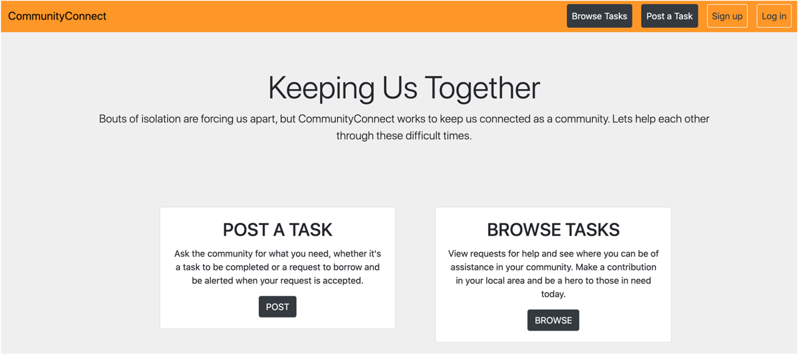
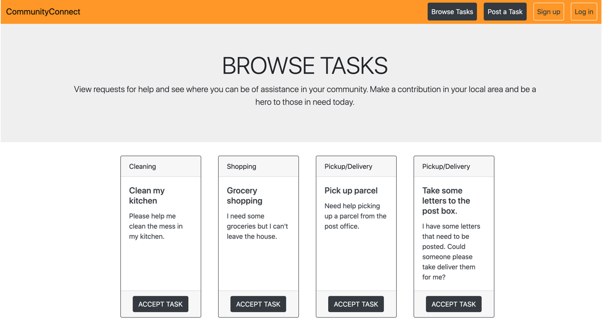

# CommunityConnect
[](https://badge.fury.io/gh/tterb%2FHyde)
[]()
## Description
CommunityConnect is an online app, connecting people who need help with volunteers in their community. Users can post tasks or requests on the site, to show they need help. Other users can then view the tasks available and accept them.  Think Airtasker for volunteers...
## Motivation
Now that Australia is entering COVID-Normal, people are thinking about the habits they want to keep from lockdown.  One of those is stronger links to their community.  Until vaccines are fully rolled out, older and less mobile people will need help with shopping and home maintenance.  Neighbours may need to borrow tools and equipment, and everyone will need to find smart ways to travel less.
## Screenshots


## Build status
Minimum Viable Product. Ready for use, but requiring further testing and feedback.
## Key technologies
* Javascript
* SQL and Sequelize
* Handlebars
* Node Experess
## Code Example
```// Dependencies
const express = require(‘express’);
const exphbs = require(‘express-handlebars’);
const db = require(‘./models’);
// Create an instance of the express app.
const app = express();
// Set the port of our application
// process.env.PORT lets the port be set by Heroku
const PORT = process.env.PORT || 8080;
// Sets up the Express app to handle data parsing
app.use(express.urlencoded({ extended: true }));
app.use(express.json());
// Static directory
app.use(express.static(‘public’));
// Set Handlebars as the default templating engine.
app.engine(‘handlebars’, exphbs({ defaultLayout: ‘main’ }));
app.set(‘view engine’, ‘handlebars’);
// Import routes
const apiRoutes = require(‘./routes/api-routes’);
const htmlRoutes = require(‘./routes/html-routes’);
apiRoutes(app);
htmlRoutes(app);
// Sync the database then start our server so that it can begin listening to client requests.
db.sequelize.sync().then(() => {
  app.listen(PORT, () => {
    // Log (server-side) when our server has started
    console.log(`Server listening on: http://localhost:${PORT}`);
  });
});
```
## Installation
Requires NPM, otherwise working on Heroku